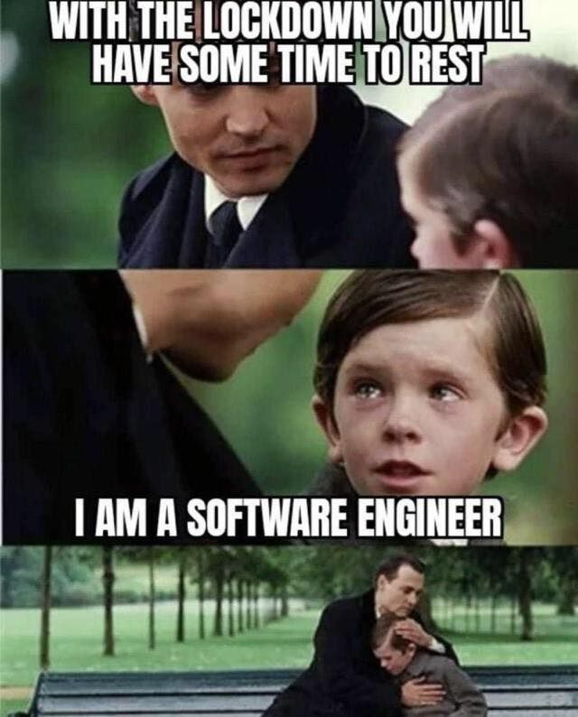

# The safest web analytics tool, with your complete ownership.

There are several cool looking, sophisticated Web Analytics tools out there.
They are used by developers, startups, big companies and corporations... Well, EVERYONE!

<h3>
But, how can you ensure that you have FULL OWNERSHIP of the data that you are recording and analyzing? SUS!
</h3>

<h4>So, what's the solution?</h4>

This tool helps you to gain full control of WHAT you are recording? How you are recording it? and most importantly, how to deal with the data recorded?

<ul>
<li>You have complete access to the code (it's just 1 little JavaScript file called <code>webAnalytics.js</code>). It has no copyright. Feel free to look at all the code, change to best fit your needs, modify it and so on...</li>

<li>You have complete ownership. All data is stored in JSON format. You decide what to do with it. (<a href="#instructions">Click here</a> to see how to use it)</li>

<li>
It took me only 1.25 hours to make the whole thing, and it works! So, I am pretty sure you will find creative ways to mould and shape it to make it a better tool.

</li>
</ul>

<h2>How to use it?</h2>

Just put the following code in your HTML file, and see the magic:

<code>
&#9001;script src="./webTracker.js" class="analyticsScript" data-events='["click", "change"]' data-postprocess='console.log("heyy")' defer &#9002;	
&#9001;/script&#9002;
</code>
  

<h4>Dont freak out! Here is an explaination of all the attributes:</h4>

1. <b>class="analyticsScript"</b>: Please do not change this. It is necessary for script to function and connect with HTML.

2. <b>data-events='[...]'</b>: It is a list of all the events you want to capture. Here is a list of all possible events (https://developer.mozilla.org/en-US/docs/Web/Events)

3. <b>data-postprocess</b>: You need to pass a string of the called function that you want to execute "When user close the tab/window". It is necessary to post-process the recorded data like saving it in your DataBase or making a POST request, and so on... I know... The interface is really bad, but I am still trying to make it better. I promise.

4. The <b>defer</b> attribute is necessary to load the script after HTML is completely loaded. Just to play it safe...

<h2>❤️ Share some love!</h2>

I am a honors Computer Science student at University at Buffalo. I need your support.

If you like the concept, and want to grow it, please contribute

And if you want to team up, please email me at: <a href="mailto:prakshal@buffalo.edu">prakshal@buffalo.edu</a>

<h4><b>and if you are a RECRUITER or CEO or DEVELOPER in a company</b></h4>

I get shit done. Hire me PWEEEEEZ! Contact me on above mentioned email :)

<h2>My main project</h2>
I have been working on a tool called&nbsp;<mark><b>&nbsp;Zeal&nbsp;</b></mark>&nbsp;with the mission to make teammate search for events, personal/academic projects, and events as simple as googling. It took me 4 months working alone to make it. Please support me by signing up. Here is the link:
<a href="https://www.zeal.courses/#/signup" target="_blank">https://www.zeal.courses/#/signup</a>